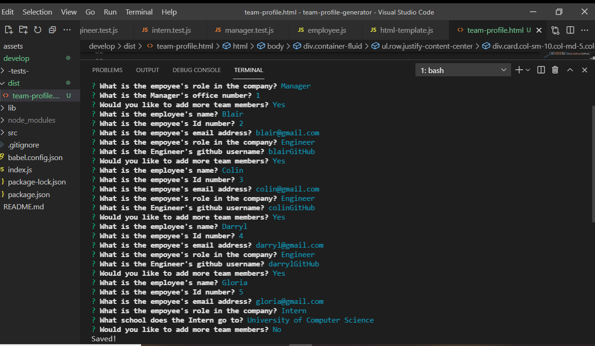

# Team Profile Generator

## Table of Contents

- [Description](#description)
- [Installation](#installation)
- [Usage](#usage)
- [Links](#links)
- [Screenshots](#screenshots)

## Description

This handy app will generate a great looking page of your Work Team!

This app uses:
* Inquirer
* Javascript
* HTML
* Jest - for Testing

## Installation

* Clone the Repository
* Open up your terminal and change into the cloned folder
* Type "npm i" to install the dependancies
* Type "npm start' to start the App!

## Usage

This App is not a live site therefore the below video will show how to run and use it!

[Video Link!](https://drive.google.com/file/d/1OkvsU1DWg3iC-ZQkG6C9NCBQ3yxv3U4s/view?usp=sharing)

## Links

* GitHub: https://github.com/Kel03-byte/team-profile-generator

## Screenshots

A screenshot of the terminal in action and the example HTML file

The Terminal!

Example HTML file!
